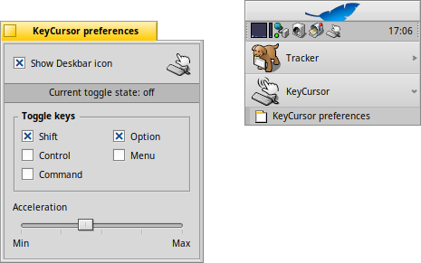

 **KeyCursor** for [Haiku](https://www.haiku-os.org)

* * *

- (original version) by Nathan Schrenk.
- originally posted on BeBits by Eugenia Loli-Queru.
- (this version) by Oscar Lesta and GUI tweaks by Humdinger.

## What is this?

It's an update to Nathan Schrenk's mighty KeyCursor input_server add-on.    
Read his [BeNewsLetter article](article.txt) to find out more.

This one does all the original version did (let you simulate a mouse using the keyboard), and more.

- Now you have a little preferences app that allows you to:
	- choose which keys will toggle KeyCursor on/off
	- configure the acceleration factor
	- show a replicant that'll show the on/off state

- PageUp and PageDown act as a vertical mouse wheel when KeyCursor its active.

Just try it on Web+, it gives you a smooth scroll effect, kinda. I find it very useful to read
the BeBook, mouseless :-)

## Basic usage:

Hit and release the toggle key(s) to activate KeyCursor, then use the arrow keys to move the cursor.

The SPACEBAR acts as the primary button (left-click), together with SHIFT you get a secondary 
button event (right-click).

Hit the toggle key(s) again to deactivate KeyCursor.

## How to (un) install it?

Easiest way is just using HaikuDepot, or pkgman:

- `pkgman install keycursor`
- `pkgman uninstall keycursor`.

If compiling/installing from sources: Use the provided install.sh/uninstall.sh scripts.

## What else do I need to know?

The preflet allows you to configure the "togglekeys", but not the "click" or "move" keys. 
Pull-requests are welcome, in case you want to make it more complete.

Interaction with other input filters: works OK with InstantClick and TwoWheels (the ones I use). 
Your mileage may vary.

To build from sources, just type "make" and "make bindcatalogs" (to include localizations), 
then use the install scripts.

As requested by the previous maintainer, I'll let you know where to get the older versions:

- Eugenia's version:
  - http://bezip.de/app/777/
  - https://pulkomandy.tk/~beosarchive/unsorted/BDifferent/System/Add-Ons/input_server/KeyCursor-1.0.zip

- Nathan's (original) version:
  - https://pulkomandy.tk/~beosarchive/unsorted/ftp.ntua.gr/mirror/BeOS/samples/input_server/KeyCursor.zip

## Thanks to:

- Nathan Schrenk - for the original version, quite handy when things go wrong with your 
input_server device hacking efforts.
- Thomas Thiriez - for parts of his EasyMove input_server filter addon and prefs app.
- OBOS (now Haiku) devs - I used some bytes from their cvs too.
- Eugenia - for transfering the app to me.

## History/Changelog

Newer versions, if any, will be available here: https://github.com/HaikuArchives/KeyCursor

1.2 Haiku-only from now on...

- Added Deskbar replicant.
- Added layout management and localization.
- Added status view to preflet.
- Added vector icons.
- Changed settings format (flattened BMessage to be future proof).
- Minor changes and cleanups.

1.1 First version:

For BeOS (2004/04/16):
- http://www.bebits.com/apps/1941/
- https://pulkomandy.tk/~beosarchive/unsorted/BDifferent/System/Add-Ons/input_server/KeyCursor-1.1.zip

For Haiku (2021/12/15):
- https://github.com/HaikuArchives/KeyCursor/releases/tag/1.1

### Notes

On BeOS R5, we could have the same binary "KeyCursor" addon placed in "add-ons/input_server/filter" and a symlink with the same name under "add-ons/input_server/devices" and it would work.

On Haiku that doesn't seems to work at all, and KeyCursor only works when those do NOT have the same name (changing the name of either the binary, or the name of the symlink, makes it work).
